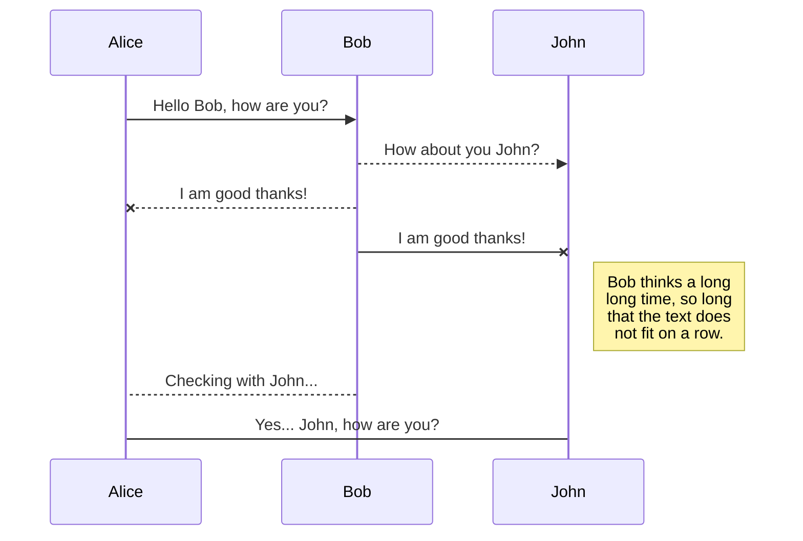
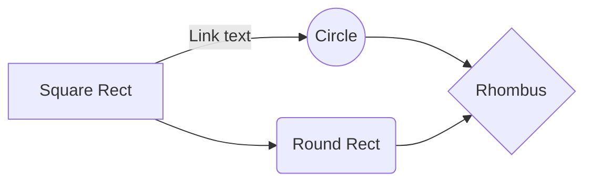

# 우주 Uzoo
#### _공부/업무에 방해되는 스마트폰, 이제는 집중 도구로 사용할 수는 없을까?_

## 기획 의도

사용자가 스마트폰의 화면잠금 및 타이머를 활용하여, 학업의 도움과 시간측정을 제공합니다.

잠시 핸드폰을 내려놓고 현실의 중요한 일에 집중해야 할 때,
우주 : Uzoo 에서 동물을 키워 보세요. 시간이 지남에 따라, 동물은 점점 자랄것입니다. 
하지만 스마트폰의 유혹에 견디지 못하고 우주 : Uzoo 앱을 나가버리면 동물이 병에 들어버릴 것입니다.
동물을 키워나가며 얻게 되는 성취감과 책임감 덕분에,
핸드폰에서 점차 멀어지고 시간을 더욱 효율적으로 활용할 수 있습니다.

## 사용 언어
  : flask를 기반으로 둔 API를 설계 
  : 안드로이드 스튜디오에서 프론트엔드 개발

##  사용툴
> ### 기본사용 툴

 : flask를 이용하여 Restful API 구현에 사용했습니다. 

 : 앱의 화면 구현/프론트엔드에 사용하였습니다. 

 : DB관리 및 쿼리문 작성에 사용하였습니다.

 : 서버 배포, CI/CD, 서버리스를 이용하여 서버에 배포했습니다.

 : 파이썬을 이용하여 코드 작성 및 테스트에 사용했습니다.

**ERD 클라우드** : 테이블 기획하는 데 사용했습니다. 

 :  아이콘 제작, 화면 기획서 등 디자인이 필요한 부분에 사용하였습니다.

> ### 협업툴
 : 두 개의 레파지토리로 나누어서, 각 API 관리와 안드로이드 스튜디오 개발 협업툴로 사용했습니다.

  : RestfulAPI 테스트 및 서버 적용 여부 테스트에 사용하였습니다.
 
    : 기본 소통, 파일 전달, 회의록 작성 등 기록용으로 사용했습니다.
  
  
: API 명세서 작성, 대량 리소스 보관, 문서 작성 등에 사용하였습니다.

##  AWS
RDS
S3
IAM
Lambda
Rekognition
API Gateway
AwS CloudWatch

##  프로젝트 개요
스마트폰에 집중 시간을 설정합니다. 
그리고 집중 시간 동안 키워낼 동물을 선택합니다. 
내 할일을 다 하고 돌아오면, 내가 키운 동물을 확인 할 수 있습니다.

|  타이머 기능 |  동물 | 촬영 | 
|--|--|--|
|  |  |  | 
|내가 집중할 시간을 선택해요! 핸드폰을 만지거나, 다른 앱을 키는 순간 타이머는 자동 소멸 됩니다.  | 집중시간을 완료하여 키운 동물을 나의 우주에서 확인해보아요.  | 집중하기 적합한 환경인지 촬영하고 추가 코인을 얻어요! |

.
|타이머 기능|동물|촬영| 
|--|----|---|
|  |  |  | 
|내가 집중할 시간을 선택해요! 핸드폰을 만지거나, 다른 앱을 키는 순간 타이머는 자동 소멸 됩니다.  | 집중시간을 완료하여 키운 동물을 나의 우주에서 확인해보아요.  | 집중하기 적합한 환경인지 촬영하고 추가 코인을 얻어요! |

## 화면 플로우

[상세 플로우 차트 보기 클릭](https://www.figma.com/file/NTCJN9dpGnpSRmIulOm2dn/%ED%94%8C%EB%A1%9C%EC%9A%B0%EC%B0%A8%ED%8A%B8?node-id=0:1)

##  화면 구성

StackEdit stores your files in your browser, which means all your files are automatically saved locally and are accessible **offline!**

## 사용 기술

## 문제점 및 해결방법

|                |ASCII                          |HTML                         |
|----------------|-------------------------------|-----------------------------|
|Single backticks|`'Isn't this fun?'`            |'Isn't this fun?'            |
|Quotes          |`"Isn't this fun?"`            |"Isn't this fun?"            |
|Dashes          |`-- is en-dash, --- is em-dash`|-- is en-dash, --- is em-dash|

## UML diagrams

You can render UML diagrams using [Mermaid](https://mermaidjs.github.io/). For example, this will produce a sequence diagram:

And this will produce a flow chart:

